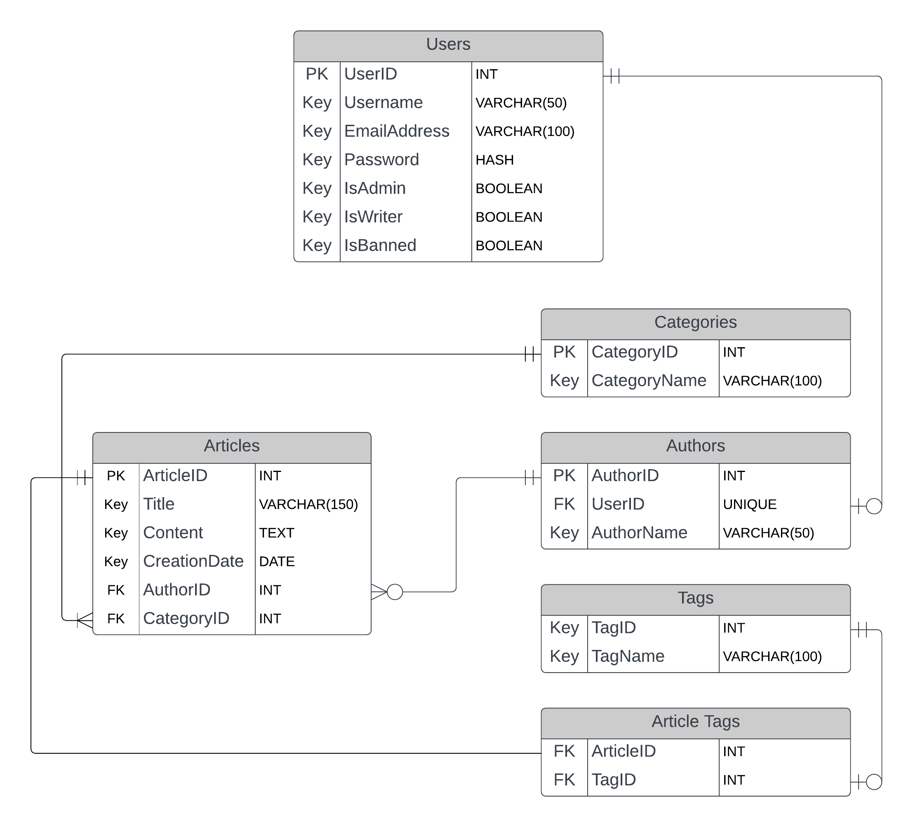
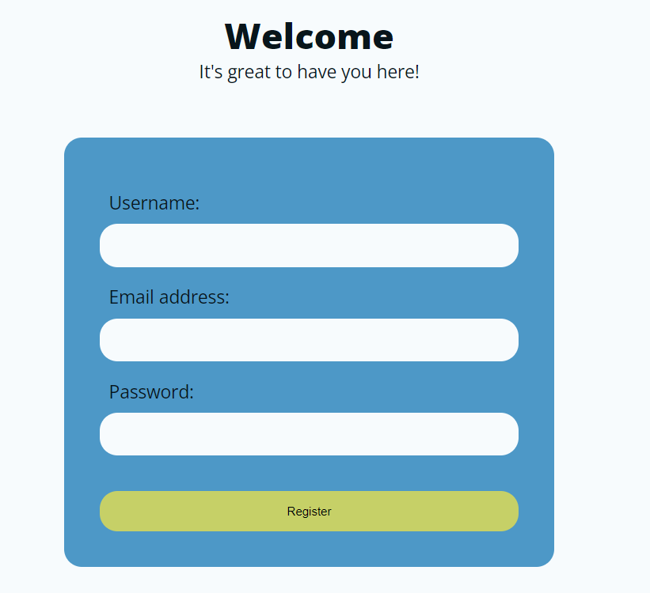

<p align="center"></a></p>

# Project Documentation: Tech News Blog

1.  [Overview](#overview)

2.  [Database](#database)

    -   [Entity Relationship Diagram](#entity-relationship-diagram)

3.  [Website Routes](#website-routes)

    -   [Required](#required)

    -   [Additional](#additional)

4.  [Compulsory Task 1](#compulsory-task-1)

    -   [Home page requirements](#home-page-requirements)

    -   [Article View](#article-view)

    -   [Category View](#category-view)

    -   [Tag View](#tag-view)

    -   [Legal Pages](#legal-pages)

5.  [Compulsory Task 2](#compulsory-task-2)

    -   [Search](#search)

6.  [Cookie Notice](#cookie-notice)

7.  [Footer Date](#footer-date)

8.  [Bonus Task 1 - Writers Dashboard](#bonus-task-1---writers-dashboard)

9.  [Bonus Task 2 - Admin Dashboard](#bonus-task-2---admin-dashboard)

10. [Bonus Task 3 - User Auth](#bonus-task-3---user-auth)

    -   [Login](#login)

    -   [Register](#register)

11. [Notable Mentions](#notable-mentions)

## Overview

This documentation provides an overview of the mock website created for a fictional tech news blog. The project emphasizes robust user authentication following industry-standard security practices.

NB: Please ensure you run `php artisan hash:user-passwords`once you have inserted the data I have provided. This command ensures all user passwords are hashed. This is just for the test data, when an individual creates a new user via the site their password will be hashed automatically.

## Database

Please insert the data provided in 'database.sql' in the order provided, as it is a relational database there will be errors if a flied is entered before its foreign key reference.

As mentioned above it is extremely important to run `php artisan hash:user-passwords` to ensure the program runs as expected. The details for this command can be found in `app\Console\Commands\HashUserPasswords.php`

All required article categories presented in in the task requirements are present:

```sql
INSERT INTO Categories (CategoryName) VALUES
('Tech news'),
('Software reviews'),
('Hardware reviews'),
('Opinion pieces');
```

### Entity Relationship Diagram

Below is the ERD for the website's database.



## Website Routes

All required routes presented in in the task requirements are present.

### Required

| Page          | Route               |
| ------------- | ------------------- |
| Home          | /                   |
| Article View  | /article/{id}       |
| Category View | /category/{slug}    |
| Tag View      | /tag/{slug}         |
| About Us      | /about              |
| Search        | /search             |
| Legal         | /legal/{subsection} |

### Additional

| Page              | Route            | Description       |
| ----------------- | ---------------- | ----------------- |
| Login             | /login           | Login in route    |
| Register          | /register        | Register Route    |
| Dashboard         | /dashboard       | Writers dashboard |
| Dashboard - admin | /dashboard/admin | Admin dashboard   |

## Compulsory Task 1

The ERD diagram is present above.

### Home page requirements

Below is an image of what the article card looks like on the home page of the site. The main title, subheading, continue reading and each tag are all links that point to their respective destinations

File path: [resources\views\home.blade.php](resources\views\home.blade.php)


### Article View

Each article can be viewed via /article/{ArticleID}.
File path: [routes\web.php](routes\web.php)

```php
Route::get('/article/{id}', [ArticleController::class, 'showArticle'])->name('article.show');
```

All requests get routed to the [Article Controller](app\Http\Controllers\ArticleController.php)

### Category View

Each category can be viewed via /category/{slug}.
File path: [routes\web.php](routes\web.php)

```php
Route::get('/category/{slug}', [CategoriesController::class, 'showCategory'])->name('category.show');
```

All requests get routed to the [Categories Controller](app\Http\Controllers\CategoriesController.php)

### Tag View

Each tag can be viewed via /tag/{slug}.
File path: [routes\web.php](routes\web.php)

```php
Route::get('/tag/{slug}', [TagsController::class, 'showTag'])->name('tag.show');
```

All requests get routed to the [Tag Controller](app\Http\Controllers\TagsController.php)

### Legal Pages

Accesses /legal results in an option to view either Terms of Service or Privacy policy. Both /legal/tos and legal/privacy have the same end point. Different content is register based on the slug.

[Legal Page](resources\views\legal.blade.php)

Route:

```php
Route::group(['prefix' => 'legal'], function () {
    Route::get('/', [LegalController::class, 'showLegal'])->name('legal.show');
    Route::get('/{subsection}', [LegalController::class, 'showLegalSubsection'])
        ->where('subsection', 'tos|privacy')
        ->name('legal.subsection');
});
```

Page Logic:

```php
@if(isset($subsection) && $subsection === 'tos')
    // Display tos
@elseif(isset($subsection) && $subsection === 'privacy')
    // Display privacy
@else
    // Display options
@endif
```

## Compulsory Task 2

### Search

I did not created 3 different search bars as I believe that is not user experience, taking that into consideration i opted to create a single search bar along with a drop down menu with options; ArticleID, Category, Tags. This way the user can select what that would like to search for in a manner that is user friendly.

Search logic: [app\Http\Controllers\SearchController.php](app\Http\Controllers\SearchController.php)

```html
<form class="flex search-bar" action="{{ route('search.action') }method="post">
    @csrf
    <input class="text" type="text" name="query" placeholder="Search...">
    <select class="text" name="type">
        <option value="article">Article ID</option>
        <option value="category">Category</option>
        <option value="tag">Tag</option>
    </select>
    <button class="btn btn-primary" type="submit">Search</button>
</form>
```


## Cookie Notice

A cookie notice is displayed on every page of the site, once the user closes the cookie or agrees to it, it no longer renders.

Cookie Logic: [public\javascript\script.js](public\javascript\script.js)
Cookie Component: [resources\views\components\cookie-notice.blade.php](resources\views\components\cookie-notice.blade.php)


## Footer Date

Footer Date Logic: [resources\views\components\footer.blade.php](resources\views\components\footer.blade.php)

```php
<p class="center copyright logo-box-text__footer">
    Copyright © 2023-{{ now()-> year }} by Cool Tech PTY (LTD). <br />All rights
    reserved
</p>
```

## Bonus Task 1 - Writers Dashboard

Below is an image of the writers dashboard along with valuable information on how the route works

Some key points:

-   It is available via `/dashboard`
-   Only users with IsWriter are able to access it
-   If a normal user tries to access it they get redirected to the home page
-   If a non logged in user tries to access it they get redirected to the login page with an auth required message.
    ```php
    return redirect()->route('login')->withErrors(['login' => 'You must blogged in to access the dashboard.']);
    ```
-   If an admin tries to access it the get redirected to `/dashboard/admin`
-   The authors names gets automatically populated based on the user that is logged in. It uses the relation between UserID in current session the UserID present in the Author table

    ```php
    $author = DB::table('Authors')->where('UserID', $user->UserID)->first();
    ```

Logic(Controlling Access): [app\Http\Controllers\UserController.php](app\Http\Controllers\UserController.php)
Logic(Adding Data): [app\Http\Controllers\CoolTechDBController.php](app\Http\Controllers\CoolTechDBController.php)

Dashboard routes:

```php
Route::group(['prefix' => 'dashboard'], function () {
    Route::get('/', [UserController::class, 'validateUser'])->name('dashboard');
    Route::get('/admin', [UserController::class, 'validateAdmin'])->name('admin');
});
```


## Bonus Task 2 - Admin Dashboard

Below is an image of the admin dashboard along with valuable information on how the route works

### User Management

The admin has the ability to manage users.


### Article Management

The admin has the ability to manage articles.


## Bonus Task 3 - User Auth

All logic for the /login and /register route: [app/Http/Controllers/AuthController.php](app/Http/Controllers/AuthController.php)

## Login

Below is an image of the login route along with some valuable information about how logic behind the authentication

Some key points:

-   Users get an error if details are incorrect
    ```php
    return redirect()->back()->withErrors(['login' => 'Invalid credentials'])->withInput();
    ```
-   If admin successfully logged in they get redirected to admin dashboard
-   If writer successfully logged in they get redirected to dashboard
-   If reader successfully logged in they get redirected home

Route Information:

```php
Route::group(['prefix' => 'login'], function () {
    Route::get('/', [AuthController::class, 'showLoginForm'])->name('login');
    Route::post('/', [AuthController::class, 'login'])->name('login.submit');
});
```


## Register

Below is an image of the register route along with some valuable information about how logic behind the authentication

NB: Please note when registering user, it requires a secure password. Here is an example of a valid password: `aG8=02Sh<63u`

-   Users get an error if details are incorrect
    ```php
    if ($validator->fails()) {
        return redirect()->back()->withErrors($validator)->withInput();
    }
    ```
-   User is regarded as reader and is redirected home

Route Information:

```php
Route::group(['prefix' => 'register'], function () {
    Route::get('/', [AuthController::class, 'showRegisterForm'])->name('register');
    Route::post('/', [AuthController::class, 'register'])->name('register.submit');
});
```



## Notable Mentions

The Buttons is the header change and are styled differently based on who is logged in, all subtle changes but make the ux better, in my opinion

Admin/Writer:
If the logged in user is an admin or a writer their name will be displayed on top of two buttons dashboard(which directs to different routes based on user) and log out


Reader:
If the logged in user is normal user their name will be displayed next to the log out button.


```

```
